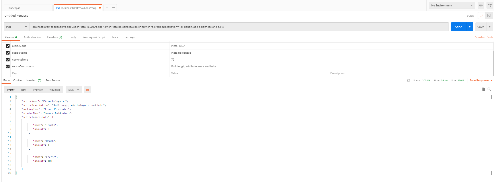

# Eindproject Advanced Programming Topics

In dit project heb ik een API uitgewerkt die gebruikers recepten laat aanmaken.
Bij elk recept hoort een naam, tijd en omschrijving.

Een gebruiker kan eventueel ook ingrediënten toevoegen aan een recept. 
Hiervan worden de naam en hoeveelheid bijgehouden.

Link naar user microservice: https://github.com/JasperGuldentops/Microservice-User

Link naar recept microservice: https://github.com/JasperGuldentops/Microservice-Recipe

Link naar ingredient microservice: https://github.com/JasperGuldentops/microservice-ingredient

#SwaggerUI screenshot

#Microservice Diagram

Postman Screenshots

#GET alle recepten

#GET recepten per naam van ingredient

#GET recepten per naam van recept

#GET recepten per user code

#POST een user

#PUT een recept

#DELETE een recept

